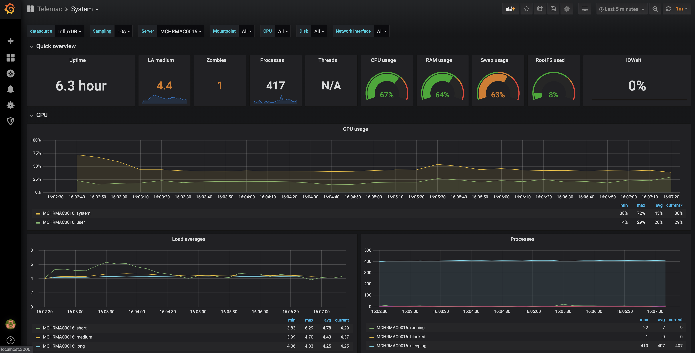
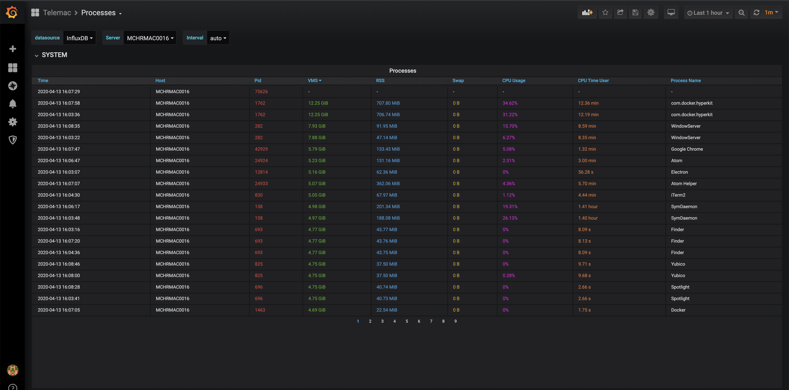

# Telemac

A quick, easy and familiar way to collect, store and view your Mac's system
metrics. Using `telegraf` agent running locally, and docker-rised `influxdb`
and `grafana`.

Persistent volumes have been created to maintain data across restarts and
destruction of the services in Docker.

## Requirements
- `brew`
- `docker-compose`

## Install

```
make install
```

## Remove
```
make remove
```

## Dashboards
Grafana is available at: http://localhost:3000

### Default Login
- Username: `admin`
- Password: `admin`

### Custom Dashboards
You can create custom dashboards in the UI under the `Custom` folder, export the
JSON, and add them to:
- `./grafana/data/dashboards/custom/`

### Telemac Dashboards:

#### [System](http://localhost:3000/d/telemacsystem/system?orgId=1&refresh=1m)
The `System` dashboard gives you an overview of pretty much all the metrics
available on your system.



#### [Processes](http://localhost:3000/d/telemacprocesses/processes?orgId=1&refresh=1m)
The `Processes` dashboard gives you a `top`-like dashboard showing information
about all the running processes on your system.


